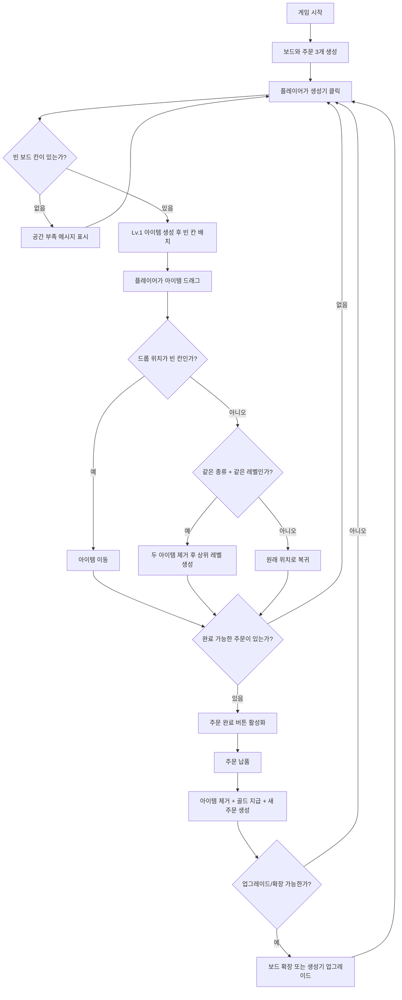

# Unity WebGL 머지 카페 퍼즐 게임 구현 지시서

이 문서는 다른 AI 또는 개발자가 바로 구현에 들어갈 수 있도록 작성한 단일 구현 지시서이다.  
추가 질문 없이 아래 내용을 기준으로 Unity 프로젝트를 완성하고, 중간중간 GitHub에 commit/push 한다.

## 0. 프로젝트 기본 조건

- Unity 버전: `2022.3.62f3`
- 프로젝트 템플릿: 이미 `2D`로 생성됨
- 최종 빌드 타겟: `WebGL`
- 배포 목표: `GitHub Pages`
- 저장소 상태: 이미 GitHub와 연결되어 있음
- 구현 방식: 2D 중심 구현
- 게임 장르: 머지 퍼즐 + 카페 주문 납품 + 성장
- 기본 아트 방향: 라이선스 문제가 없는 순수 Unity 제작물, 직접 만든 간단한 2D 도형/아이콘/텍스트 기반 아트

## 1. 가장 중요한 구현 원칙

1. 이 프로젝트는 공개 GitHub 저장소와 GitHub Pages 배포를 전제로 한다.
2. Asset Store, My Assets, Package Manager로 받은 유료/무료 에셋은 라이선스 확인 전까지 커밋하지 않는다.
3. WebGL 페이지에서 사용되는 클라이언트 에셋은 브라우저로 다운로드되므로 완전히 숨길 수 없다고 판단한다.
4. 라이선스가 불명확한 외부 에셋은 사용하지 말고, Unity 기본 기능과 직접 만든 2D 도형/아이콘으로 구현한다.
5. Unity 공식 패키지, TextMeshPro, Unity UI, 2D Sprite, 기본 Material, 직접 만든 Script/Prefab/Scene은 사용 가능하다.
6. 구현 중간중간 반드시 버전 단위로 commit/push 한다.
7. 커밋 전에는 반드시 `git status --short`와 staged file 목록을 확인해서 외부 에셋 폴더가 들어가지 않았는지 검토한다.
8. 사용자가 없어도 구현자가 스스로 씬, 스크립트, UI, 데이터 구조, 빌드 설정을 완성한다.

## 2. 외부 에셋 사용 정책

기본 정책은 `외부 에셋 미사용`이다.

허용:

- Unity 기본 Sprite, Material, UI Image
- 직접 생성한 단색/간단한 도형 아이콘
- 직접 작성한 C# 스크립트
- 직접 만든 Prefab, Scene, ScriptableObject
- TextMeshPro 같은 Unity 공식/기본 패키지

금지:

- `My Assets`에서 받은 카페, 음식, UI, 아이콘, 배경, 사운드 에셋 전체 폴더 커밋
- 라이선스가 확인되지 않은 Asset Store 패키지의 원본 파일 커밋
- 예제 씬, 데모 프리팹, 텍스처, FBX, 오디오를 통째로 커밋
- WebGL build에 라이선스 불명 에셋을 포함

외부 에셋을 꼭 사용해야 한다면:

1. 해당 에셋의 라이선스가 공개 WebGL 배포와 공개 저장소 커밋을 허용하는지 확인한다.
2. 허용되지 않거나 애매하면 사용하지 않는다.
3. 허용되는 경우에도 필요한 파일만 `Assets/MergeCafe/Art/ThirdParty/<AssetName>/` 아래로 복사한다.
4. `Assets/MergeCafe/Docs/THIRD_PARTY_NOTICES.md`에 출처, 라이선스, 사용 파일 목록을 작성한다.
5. 전체 에셋 팩 원본 폴더는 커밋하지 않는다.

권장 결론:

- 이 게임은 카페 테마지만 MVP는 단순 도형과 텍스트만으로 충분히 구현 가능하다.
- 따라서 외부 에셋 없이 순수 Unity 2D로 진행한다.

## 3. 커밋/푸시 규칙

버전은 `v0.0.1`부터 시작한다.  
각 구현 단계가 끝날 때마다 commit 후 push 한다.

커밋 메시지 형식:

```text
[v0.0.1]
[추가] 추가한 내용 한 줄
[수정] 수정한 내용 한 줄
[삭제] 삭제한 내용 한 줄
[기타] 기타 내용 한 줄
```

해당 항목에 쓸 내용이 없으면 빈값으로 남기지 말고 항목 자체를 삭제한다.

예시:

```text
[v0.0.3]
[추가] 커피 생성기와 보드 자동 배치 로직 구현
[수정] 보드 셀 UI 크기와 색상 조정
```

커밋 전 체크:

```text
git status --short
git diff --cached --name-only
```

커밋 전 확인할 것:

- Asset Store 또는 My Assets 원본 폴더가 staged 되지 않았는가
- `Library/`, `Temp/`, `Obj/`, `Build/`, `Logs/`, `UserSettings/`가 staged 되지 않았는가
- WebGL 빌드 산출물을 저장소에 넣기로 정한 경우에만 `docs/` 또는 배포용 폴더를 staged 했는가
- 커밋 메시지에 빈 `[삭제]`, `[기타]` 항목이 남아 있지 않은가

## 4. 권장 `.gitignore`

프로젝트에 `.gitignore`가 없거나 부족하면 첫 커밋 전에 보강한다.

```gitignore
[Ll]ibrary/
[Tt]emp/
[Oo]bj/
[Bb]uild/
[Bb]uilds/
[Ll]ogs/
[Uu]ser[Ss]ettings/
.vs/
.vscode/
*.csproj
*.sln
*.user
*.pidb
*.booproj
*.svd
*.pdb
*.mdb
*.opendb
*.VC.db

# Do not commit imported Asset Store / My Assets packs unless license is verified.
Assets/AssetStore/
Assets/Asset Store/
Assets/MyAssets/
Assets/My Assets/
Assets/ImportedAssets/
Assets/ThirdParty_Unverified/
```

주의:

- 실제 프로젝트의 폴더명이 다르면 해당 이름을 확인해서 추가한다.
- `Assets/MergeCafe/` 아래의 직접 만든 파일은 커밋한다.

## 5. 게임 개요

이 게임은 커피, 빵, 디저트 같은 카페 아이템을 생성하고, 같은 아이템 두 개를 합쳐 더 높은 단계의 아이템으로 만드는 머지 퍼즐 게임이다.

플레이어는 커피머신, 오븐, 냉장고 같은 생성기를 눌러 낮은 단계의 아이템을 만든다.  
같은 종류와 같은 레벨의 아이템 두 개를 합치면 상위 레벨 아이템이 된다.  
주문 목록에는 손님이 요구하는 아이템이 표시되고, 플레이어가 해당 아이템을 만들어 납품하면 골드를 얻는다.  
골드는 보드 확장, 생성기 업그레이드, 새 생성기 해금에 사용한다.

핵심 루프:

1. 생성기를 클릭해서 아이템 생성
2. 아이템을 보드에 배치
3. 같은 종류와 같은 레벨의 아이템 두 개를 머지
4. 주문에서 요구하는 아이템 제작
5. 주문 납품
6. 골드 획득
7. 보드 확장 또는 생성기 업그레이드
8. 더 높은 레벨의 주문 도전

## 6. 순서도



## 7. 씬 구성

필수 씬은 하나만 만든다.

```text
Assets/MergeCafe/Scenes/MergeCafeGame.unity
```

씬 안에 필요한 루트 오브젝트:

```text
MergeCafeGame
├── Systems
│   ├── GameManager
│   ├── BoardManager
│   ├── ItemCatalog
│   ├── OrderManager
│   ├── EconomyManager
│   └── SaveManager
├── Canvas
│   ├── TopHud
│   ├── GeneratorPanel
│   ├── BoardPanel
│   ├── OrderPanel
│   ├── UpgradePanel
│   └── ToastMessage
├── EventSystem
└── Main Camera
```

카메라:

- 2D 프로젝트 기본 카메라 사용
- `Projection`: Orthographic
- UI 중심 게임이므로 Canvas는 `Screen Space - Overlay` 권장

Canvas:

- `Canvas Scaler`: Scale With Screen Size
- Reference Resolution: `1920 x 1080`
- Match: `0.5`
- WebGL 브라우저 창 크기 변화에도 UI가 깨지지 않게 앵커를 설정한다.

## 8. 화면 레이아웃

기준 해상도는 `1920 x 1080`이다.

```text
┌──────────────────────────────────────────────────────────────┐
│ TopHud: Gold / Energy / Board Space / Settings               │
├───────────────┬──────────────────────────────┬───────────────┤
│ GeneratorPanel│ BoardPanel                    │ OrderPanel    │
│               │ 6 x 6 Merge Board             │ 3 Orders      │
│ CoffeeMachine │                              │               │
│ Oven          │                              │ Complete Btns  │
│ Fridge        │                              │               │
├───────────────┴──────────────────────────────┴───────────────┤
│ UpgradePanel: Board Expand / Generator Upgrade                │
└──────────────────────────────────────────────────────────────┘
```

권장 비율:

- `TopHud`: 화면 상단, 높이 약 80~100
- `GeneratorPanel`: 좌측, 폭 약 300
- `BoardPanel`: 중앙, 가능한 큰 정사각형 영역
- `OrderPanel`: 우측, 폭 약 360
- `UpgradePanel`: 하단, 높이 약 120

모바일 또는 좁은 브라우저 대응:

- 최소 목표는 PC WebGL이다.
- 그래도 터치 드래그가 가능하도록 Pointer Event 기반으로 구현한다.
- 화면이 좁으면 GeneratorPanel과 OrderPanel은 조금 줄어들어도 BoardPanel이 우선 보이게 한다.

## 9. 보드 규칙

- 전체 보드 크기: `6 x 6`
- 전체 셀 수: `36`
- 초기 해금 셀: 중앙 또는 좌상단 기준 `4 x 4`, 총 `16`칸
- 잠긴 셀은 어둡게 표시하고 아이템을 놓을 수 없다.
- 각 셀에는 아이템이 최대 하나만 들어간다.
- 빈 해금 셀에는 아이템을 이동할 수 있다.
- 잠긴 셀에는 아이템 이동, 생성, 머지가 불가능하다.
- 이미 아이템이 있는 셀에는 다른 아이템을 이동할 수 없다.
- 단, 같은 종류와 같은 레벨이면 머지가 가능하다.

머지 가능 조건:

```text
source.itemType == target.itemType
source.level == target.level
source.level < maxLevel
```

머지 결과:

1. 드래그한 아이템과 대상 아이템을 제거한다.
2. 대상 셀 위치에 `level + 1` 아이템을 생성한다.
3. 짧은 머지 이펙트를 재생한다.
4. 최고 레벨이면 더 이상 머지하지 않고 원위치시킨다.

머지 불가능 조건:

- 종류가 다름
- 레벨이 다름
- 대상이 최고 레벨
- 대상 셀이 잠김
- 드롭 위치가 보드 밖

머지 불가능 시:

- 아이템을 원래 위치로 되돌린다.
- 짧은 흔들림 또는 빨간 테두리 피드백을 준다.
- 토스트 메시지는 너무 자주 뜨지 않게 한다.

## 10. 아이템 체계

초기 완성 목표는 3개 계열을 구현한다.

```csharp
public enum ItemType
{
    Coffee,
    Bread,
    Dessert
}
```

각 계열은 Lv.1~Lv.5까지 존재한다.

### Coffee 계열

| Level | 이름 | 표시 약어 | 기본 판매가 |
|---:|---|---|---:|
| 1 | 원두 커피 | C1 | 5 |
| 2 | 따뜻한 커피 | C2 | 15 |
| 3 | 아메리카노 | C3 | 35 |
| 4 | 라떼 | C4 | 80 |
| 5 | 스페셜 커피 | C5 | 160 |

### Bread 계열

| Level | 이름 | 표시 약어 | 기본 판매가 |
|---:|---|---|---:|
| 1 | 반죽 | B1 | 5 |
| 2 | 작은 빵 | B2 | 18 |
| 3 | 크루아상 | B3 | 45 |
| 4 | 샌드위치 | B4 | 100 |
| 5 | 디저트 플레이트 | B5 | 210 |

### Dessert 계열

| Level | 이름 | 표시 약어 | 기본 판매가 |
|---:|---|---|---:|
| 1 | 크림 | D1 | 8 |
| 2 | 푸딩 | D2 | 22 |
| 3 | 컵케이크 | D3 | 55 |
| 4 | 케이크 | D4 | 130 |
| 5 | 시그니처 케이크 | D5 | 260 |

시각 표현:

- 외부 에셋 없이 구현한다.
- 각 계열은 다른 색상 팔레트로 구분한다.
- 아이템 토큰은 둥근 사각형 또는 원형 Sprite/UI Image로 표현한다.
- 중앙에 `C1`, `B2`, `D3` 같은 약어를 크게 표시한다.
- 아래 또는 툴팁에 한국어 이름을 표시한다.

권장 색상:

- Coffee: 갈색 계열
- Bread: 노랑/주황 계열
- Dessert: 분홍/보라 계열

## 11. 생성기 시스템

생성기는 클릭하면 아이템을 만든다.  
생성된 아이템은 해금된 빈 보드 셀 중 하나에 자동 배치된다.

필수 생성기:

| 생성기 | 출력 아이템 | 초기 에너지 | 회복 주기 | 해금 조건 |
|---|---|---:|---:|---|
| 커피머신 | Coffee Lv.1 | 10 | 30초당 +1 | 기본 해금 |
| 오븐 | Bread Lv.1 | 8 | 35초당 +1 | 150 Gold |
| 냉장고 | Dessert Lv.1 | 6 | 45초당 +1 | 300 Gold |

생성 규칙:

1. 생성기 버튼을 클릭한다.
2. 생성기 에너지가 1 이상인지 확인한다.
3. 해금된 빈 셀이 있는지 확인한다.
4. 조건이 맞으면 해당 생성기의 Lv.1 아이템을 만든다.
5. 에너지를 1 감소시킨다.
6. 빈 셀이 없으면 생성하지 않고 `보드 공간이 부족합니다` 메시지를 표시한다.
7. 에너지가 없으면 생성하지 않고 남은 회복 시간을 표시한다.

업그레이드 규칙:

- 생성기마다 upgradeLevel을 가진다.
- 업그레이드 비용은 단계별로 증가한다.
- 최소 구현에서는 `최대 에너지 증가`만 구현해도 된다.

권장 업그레이드:

| Upgrade Level | 비용 | 효과 |
|---:|---:|---|
| 1 | 0 | 기본 상태 |
| 2 | 200 | 최대 에너지 +3 |
| 3 | 500 | 최대 에너지 +5, 10% 확률로 Lv.2 생성 |
| 4 | 1000 | 최대 에너지 +8, 20% 확률로 Lv.2 생성 |

## 12. 주문 시스템

주문은 동시에 3개 표시한다.

주문 데이터:

```csharp
public sealed class CafeOrder
{
    public string orderId;
    public ItemType requiredItemType;
    public int requiredItemLevel;
    public int rewardGold;
}
```

초기 주문:

| 주문 | 필요 아이템 | 보상 |
|---:|---|---:|
| 1 | Coffee Lv.2 | 30 Gold |
| 2 | Coffee Lv.3 | 70 Gold |
| 3 | Bread Lv.2 | 50 Gold |

주문 완료 조건:

1. 보드에 `requiredItemType`과 `requiredItemLevel`이 일치하는 아이템이 있어야 한다.
2. 주문 카드의 완료 버튼이 활성화되어야 한다.
3. 완료 버튼 클릭 시 해당 아이템 하나를 보드에서 제거한다.
4. `rewardGold`만큼 골드를 추가한다.
5. 완료한 주문은 사라지고 새 주문이 생성된다.

주문 생성 규칙:

- 초반에는 만들 수 있는 아이템보다 너무 높은 레벨을 요구하지 않는다.
- 현재 해금된 생성기와 플레이어 진행도를 기준으로 주문 난이도를 조절한다.
- 최초 버전에서는 아래 가중치로 랜덤 생성한다.

```text
Lv.2: 45%
Lv.3: 35%
Lv.4: 15%
Lv.5: 5%
```

단, 해당 ItemType의 생성기가 해금되지 않았다면 그 타입의 주문은 생성하지 않는다.

보상 계산:

```text
rewardGold = baseSellPrice(requiredItem) * 2 + requiredItemLevel * 10
```

최초 구현에서는 테이블 값을 직접 넣어도 된다.

## 13. 골드와 성장 시스템

초기 골드:

```text
Gold: 0
```

골드 사용처:

1. 보드 셀 해금
2. 생성기 업그레이드
3. 새 생성기 해금

보드 확장:

- 전체 보드는 6x6으로 고정한다.
- 처음에는 16칸만 해금한다.
- 골드로 잠긴 셀을 하나씩 해금한다.
- 해금 비용은 점점 증가한다.

권장 해금 비용:

```text
첫 번째 추가 셀: 100 Gold
이후 추가 셀: 이전 비용 + 50 Gold
```

해금 버튼:

- `UpgradePanel`에 `보드 확장` 버튼을 둔다.
- 골드가 부족하면 비활성화한다.
- 다음 해금 비용을 버튼에 표시한다.

## 14. 저장 시스템

WebGL에서도 유지되도록 `PlayerPrefs` 기반 저장을 구현한다.

저장할 데이터:

- Gold
- 보드 해금 상태
- 보드 위 아이템 목록
- 생성기 해금 상태
- 생성기 에너지
- 생성기 업그레이드 레벨
- 현재 주문 3개

저장 타이밍:

- 아이템 생성 후
- 아이템 이동/머지 후
- 주문 완료 후
- 보드 확장 후
- 생성기 업그레이드 후
- 앱 종료 또는 페이지 이탈 전 가능한 경우

개발 편의 기능:

- `Settings` 또는 작은 Debug 버튼에 `초기화` 기능을 둔다.
- 초기화 버튼은 확인 팝업을 거친다.
- 릴리스에서도 초기화 기능은 남겨도 된다.

## 15. 조작 방식

PC:

- 생성기 클릭: 아이템 생성
- 아이템 드래그: 이동
- 같은 아이템 위에 드롭: 머지
- 주문 완료 버튼 클릭: 납품
- 업그레이드 버튼 클릭: 골드 사용

모바일/터치:

- Pointer Event 기반으로 구현해서 마우스와 터치를 모두 처리한다.
- `IBeginDragHandler`, `IDragHandler`, `IEndDragHandler`, `IPointerClickHandler` 사용 권장

드래그 구현 요구:

- 드래그 중 아이템은 최상단 Canvas 레이어로 올라와야 한다.
- 드래그 중 반투명 또는 살짝 확대된다.
- 유효한 드롭 대상 셀은 하이라이트된다.
- 드롭 실패 시 원위치로 돌아간다.

## 16. UI 피드백

필수 피드백:

- 아이템 생성 성공 시 셀에 짧은 팝 애니메이션
- 머지 성공 시 대상 셀에 반짝임 또는 스케일 애니메이션
- 머지 실패 시 원위치 복귀와 짧은 흔들림
- 주문 완료 시 골드 증가 텍스트
- 보드 공간 부족 시 토스트 메시지
- 에너지 부족 시 토스트 메시지
- 골드 부족 시 버튼 비활성화와 비용 표시

애니메이션은 복잡하지 않아도 된다.  
Coroutine으로 Scale, Alpha를 짧게 조정하는 정도면 충분하다.

## 17. 권장 폴더 구조

```text
Assets/
└── MergeCafe/
    ├── Art/
    │   ├── Generated/
    │   └── Materials/
    ├── Audio/
    ├── Docs/
    ├── Prefabs/
    │   ├── BoardCell.prefab
    │   ├── ItemToken.prefab
    │   ├── GeneratorButton.prefab
    │   └── OrderCard.prefab
    ├── Scenes/
    │   └── MergeCafeGame.unity
    ├── Scripts/
    │   ├── Board/
    │   ├── Data/
    │   ├── Generators/
    │   ├── Orders/
    │   ├── Save/
    │   ├── UI/
    │   └── Core/
    └── Settings/
```

## 18. 권장 스크립트 목록

Core:

- `GameManager.cs`: 게임 초기화, 시스템 연결
- `GameState.cs`: 현재 게임 상태 데이터
- `GameEvents.cs`: UI 갱신 이벤트

Data:

- `ItemType.cs`: 아이템 타입 enum
- `ItemDefinition.cs`: 아이템 정의
- `ItemInstance.cs`: 보드 위 개별 아이템
- `ItemCatalog.cs`: 아이템 정의 조회
- `GeneratorDefinition.cs`: 생성기 정의

Board:

- `BoardManager.cs`: 보드 데이터와 셀 상태 관리
- `BoardCell.cs`: 개별 셀 UI/드롭 처리
- `BoardGridView.cs`: 6x6 보드 생성과 렌더링

Items:

- `ItemTokenView.cs`: 아이템 UI, 드래그 처리
- `MergeResolver.cs`: 머지 가능 여부와 결과 계산

Generators:

- `GeneratorManager.cs`: 생성기 상태 관리
- `GeneratorButtonView.cs`: 생성기 버튼 UI

Orders:

- `OrderManager.cs`: 주문 생성/완료
- `OrderCardView.cs`: 주문 카드 UI

Economy:

- `EconomyManager.cs`: 골드, 비용, 구매 처리
- `UpgradeManager.cs`: 보드 확장과 생성기 업그레이드

Save:

- `SaveManager.cs`: PlayerPrefs 저장/불러오기
- `SaveData.cs`: 직렬화용 데이터 구조

UI:

- `HudView.cs`: 상단 HUD
- `ToastView.cs`: 짧은 메시지 표시
- `ConfirmPopup.cs`: 초기화 확인 팝업

## 19. 데이터 구현 방식

최초 버전에서는 ScriptableObject보다 코드 기반 카탈로그를 권장한다.  
이유는 다른 AI가 구현할 때 에셋 생성 누락으로 인한 오류를 줄일 수 있기 때문이다.

예시:

```csharp
public sealed class ItemDefinition
{
    public ItemType Type { get; }
    public int Level { get; }
    public string DisplayName { get; }
    public string ShortLabel { get; }
    public int SellPrice { get; }
    public Color Color { get; }
}
```

나중에 안정화 후 ScriptableObject로 이전해도 된다.

## 20. WebGL 설정

Build Settings:

- Platform: `WebGL`
- Scene In Build: `Assets/MergeCafe/Scenes/MergeCafeGame.unity`

Player Settings 권장:

- Company Name: 프로젝트에 맞게 설정
- Product Name: `Merge Cafe Puzzle`
- Default Canvas Width/Height는 WebGL 템플릿 기본값 사용 가능
- Run In Background: 필요 없음
- Data Caching: 켜도 됨

Publishing Settings:

- GitHub Pages 서버 헤더 설정을 직접 제어하기 어렵다.
- 우선 `Compression Format: Gzip` + `Decompression Fallback: Enabled`를 사용한다.
- GitHub Pages에서 로딩 문제가 생기면 `Compression Format: Disabled`로 바꿔 안정성을 우선한다.

WebGL 템플릿:

- 기본 템플릿 사용 가능
- 나중에 `index.html` 제목만 `Merge Cafe Puzzle`로 바꿔도 된다.

## 21. GitHub Pages 배포 방식

둘 중 하나를 선택한다.

### 권장 A: `docs/` 폴더 배포

1. Unity WebGL 빌드 출력 경로를 임시 폴더로 지정한다.
2. 빌드 결과물을 저장소 루트의 `docs/`로 복사한다.
3. GitHub repository Settings > Pages에서 source를 `main / docs`로 설정한다.
4. `docs/index.html`이 존재해야 한다.

장점:

- 설정이 단순하다.
- 별도 브랜치 관리가 필요 없다.

주의:

- `docs/`에 들어가는 파일은 공개된다.
- 라이선스 불명 에셋이 빌드에 포함되지 않았는지 반드시 확인한다.

### 선택 B: `gh-pages` 브랜치 배포

자동화에 익숙하면 `gh-pages` 브랜치에 빌드 산출물만 배포해도 된다.  
다만 최초 구현에서는 `docs/` 방식이 더 단순하다.

## 22. 구현 단계와 커밋 계획

각 단계 완료 후 commit/push 한다.

### v0.0.1 - 프로젝트 정리와 기본 씬

할 일:

- `.gitignore` 확인 및 보강
- 외부 에셋 폴더가 커밋 대상에서 제외되는지 확인
- `Assets/MergeCafe/` 폴더 구조 생성
- `MergeCafeGame.unity` 씬 생성
- 기본 Canvas, Camera, EventSystem 구성
- 빈 HUD, 보드, 생성기, 주문 패널 배치

커밋 메시지 예:

```text
[v0.0.1]
[추가] 머지 카페 기본 폴더 구조와 메인 씬 UI 골격 생성
[수정] Unity 프로젝트 gitignore 정리
```

### v0.0.2 - 데이터 모델과 보드 생성

할 일:

- ItemType, ItemDefinition, ItemCatalog 구현
- BoardManager, BoardCell 구현
- 6x6 보드 렌더링
- 4x4 초기 해금 상태 표시
- 잠긴 셀과 열린 셀 시각 구분

커밋 메시지 예:

```text
[v0.0.2]
[추가] 아이템 카탈로그와 6x6 머지 보드 생성 로직 구현
```

### v0.0.3 - 생성기와 아이템 생성

할 일:

- Coffee/Bread/Dessert 생성기 데이터 구현
- 생성기 버튼 UI 구현
- 빈 셀 자동 탐색
- 생성기 클릭 시 Lv.1 아이템 생성
- 에너지 감소와 회복 타이머 구현
- 보드 공간 부족 처리

커밋 메시지 예:

```text
[v0.0.3]
[추가] 카페 생성기와 아이템 자동 배치 시스템 구현
```

### v0.0.4 - 드래그 이동과 머지

할 일:

- ItemTokenView 드래그 구현
- 빈 셀 이동 구현
- 같은 타입/레벨 머지 구현
- 머지 실패 시 원위치 복귀
- 간단한 팝/흔들림 피드백 추가

커밋 메시지 예:

```text
[v0.0.4]
[추가] 아이템 드래그 이동과 동일 아이템 머지 규칙 구현
```

### v0.0.5 - 주문과 골드

할 일:

- OrderManager 구현
- 주문 3개 생성
- 주문 카드 UI 구현
- 완료 가능한 주문 버튼 활성화
- 주문 완료 시 아이템 제거, 골드 지급, 새 주문 생성
- HUD 골드 갱신

커밋 메시지 예:

```text
[v0.0.5]
[추가] 주문 납품과 골드 보상 시스템 구현
```

### v0.0.6 - 보드 확장과 생성기 업그레이드

할 일:

- 보드 셀 해금 비용 계산
- 보드 확장 버튼 구현
- 생성기 업그레이드 버튼 구현
- 업그레이드 효과 적용
- 골드 부족 시 버튼 비활성화

커밋 메시지 예:

```text
[v0.0.6]
[추가] 보드 확장과 생성기 업그레이드 성장 시스템 구현
```

### v0.0.7 - 저장/불러오기

할 일:

- SaveData 구현
- PlayerPrefs 저장/불러오기 구현
- 주요 행동 후 자동 저장
- 초기화 버튼과 확인 팝업 구현
- WebGL Play Mode에서 재실행 후 저장 유지 확인

커밋 메시지 예:

```text
[v0.0.7]
[추가] PlayerPrefs 기반 게임 저장과 초기화 기능 구현
```

### v0.0.8 - 연출과 사용성 개선

할 일:

- 토스트 메시지 개선
- 머지/생성/주문 완료 애니메이션 추가
- 버튼 hover/pressed 상태 정리
- 아이템 색상과 라벨 가독성 개선
- 브라우저 창 크기 변화 대응 확인

커밋 메시지 예:

```text
[v0.0.8]
[추가] 머지 피드백과 UI 사용성 연출 개선
[수정] WebGL 화면 비율 변화에 맞춘 패널 배치 조정
```

### v0.0.9 - WebGL 빌드와 GitHub Pages 준비

할 일:

- WebGL Build Settings 설정
- WebGL 빌드 실행
- GitHub Pages 배포 폴더 구성
- `docs/index.html` 확인
- 로컬 또는 브라우저에서 빌드 실행 확인
- 빌드 산출물에 외부 에셋이 포함되지 않았는지 재확인

커밋 메시지 예:

```text
[v0.0.9]
[추가] WebGL 빌드 산출물과 GitHub Pages 배포 준비
[수정] GitHub Pages 실행을 위한 WebGL 압축 설정 조정
```

### v0.1.0 - 최종 QA와 공개 플레이 가능 상태

할 일:

- 새 게임 시작부터 주문 완료까지 실제 플레이 확인
- 저장/불러오기 확인
- 보드 확장 확인
- 생성기 업그레이드 확인
- WebGL 페이지 URL 접속 확인
- 콘솔 오류 확인
- 최종 README 또는 간단한 플레이 설명 추가

커밋 메시지 예:

```text
[v0.1.0]
[추가] 공개 플레이 가능한 WebGL 머지 카페 퍼즐 완성
[수정] 최종 QA에서 발견된 UI와 진행 오류 수정
```

## 23. 최소 완성 기준

최소 완성 버전은 아래 조건을 모두 만족해야 한다.

- Unity `2022.3.62f3`에서 열림
- 2D 프로젝트 구조를 유지함
- `MergeCafeGame.unity` 하나로 게임 실행 가능
- 6x6 보드 표시
- 4x4 초기 해금 영역 표시
- 잠긴 셀 표시
- 커피머신으로 Coffee Lv.1 생성 가능
- 오븐과 냉장고 해금 또는 최소한 UI에 잠긴 상태 표시
- 아이템 드래그 이동 가능
- 같은 종류/레벨 아이템 머지 가능
- 다른 종류/레벨 아이템 머지 불가
- 주문 3개 표시
- 주문 완료 시 아이템 제거와 골드 지급
- 골드로 보드 확장 가능
- 생성기 에너지 감소와 회복 구현
- PlayerPrefs 저장/불러오기 구현
- WebGL 빌드 가능
- GitHub Pages에서 실행 가능하도록 설정
- 외부 라이선스 에셋 미포함

## 24. 테스트 체크리스트

Play Mode:

- [ ] 게임 시작 시 Gold 0으로 표시된다.
- [ ] 6x6 보드가 보인다.
- [ ] 16칸만 해금되어 있다.
- [ ] 커피머신 클릭 시 Coffee Lv.1이 생성된다.
- [ ] 빈 셀이 없으면 생성되지 않고 메시지가 뜬다.
- [ ] Coffee Lv.1 두 개를 합치면 Coffee Lv.2가 된다.
- [ ] Coffee Lv.1과 Bread Lv.1은 합쳐지지 않는다.
- [ ] Coffee Lv.2 주문 완료 시 Coffee Lv.2 하나가 제거되고 Gold가 증가한다.
- [ ] 주문 완료 후 새 주문이 생긴다.
- [ ] 보드 확장 비용이 표시된다.
- [ ] 골드가 충분하면 잠긴 셀 하나를 해금할 수 있다.
- [ ] 생성기 에너지가 0이면 아이템이 생성되지 않는다.
- [ ] 시간이 지나면 에너지가 회복된다.
- [ ] 저장 후 Play Mode를 다시 시작해도 진행 상황이 복원된다.

WebGL:

- [ ] WebGL 빌드가 성공한다.
- [ ] 브라우저에서 `index.html` 로딩이 완료된다.
- [ ] 마우스 드래그가 동작한다.
- [ ] 버튼 클릭이 동작한다.
- [ ] 브라우저 콘솔에 치명적인 오류가 없다.
- [ ] 새로고침 후 저장 데이터가 복원된다.
- [ ] GitHub Pages URL에서 실행된다.

Git:

- [ ] 각 단계마다 commit/push가 되어 있다.
- [ ] 커밋 메시지가 규칙을 따른다.
- [ ] 외부 에셋 폴더가 커밋되지 않았다.
- [ ] `Library/`, `Temp/`, `Build/` 등이 커밋되지 않았다.

## 25. 구현자가 임의로 결정해도 되는 것

아래 항목은 구현자가 스스로 결정한다.

- 정확한 UI 색상
- 아이템 아이콘 모양
- 애니메이션 세부 수치
- 주문 랜덤 가중치의 세부값
- 보드 셀 해금 순서
- 생성기 업그레이드 비용의 세부 밸런스
- 토스트 메시지 문구

단, 아래는 바꾸지 않는다.

- Unity 버전
- 2D 중심 구현
- WebGL/GitHub Pages 목표
- 공개 저장소에서 라이선스 불명 에셋 배제
- 6x6 보드
- 초기 4x4 해금
- 같은 타입 + 같은 레벨만 머지
- 주문 3개 표시
- commit/push 버전 규칙

## 26. 최종 목표

최종적으로 플레이어가 브라우저에서 접속해 바로 플레이할 수 있는 머지 카페 퍼즐 게임을 만든다.

플레이어는 생성기를 눌러 아이템을 만들고, 같은 아이템을 합쳐 더 높은 단계의 메뉴를 제작한다.  
주문을 납품해 골드를 벌고, 골드로 보드를 확장하거나 생성기를 강화한다.  
게임은 단순하지만 반복 플레이가 가능해야 하며, 첫 공개 버전은 외부 라이선스 에셋 없이 안전하게 GitHub Pages에 올릴 수 있어야 한다.
